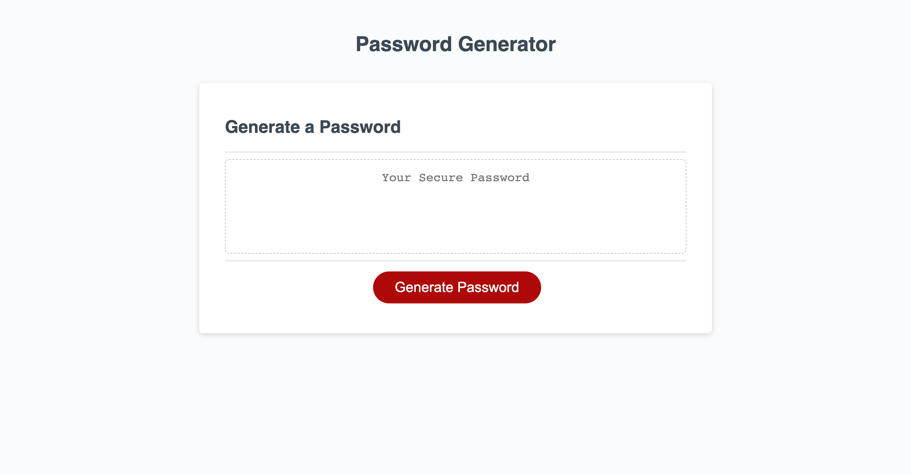

## password-generator

# description:

This application accepts a set of rules from the user regarding their desired password and then generates a random one for them. These parameters are length and inclusion on lower case, upper case, numbers, and special characters.

# screenshot:

# link to live page:

https://hcweigand10.github.io/password-generator/